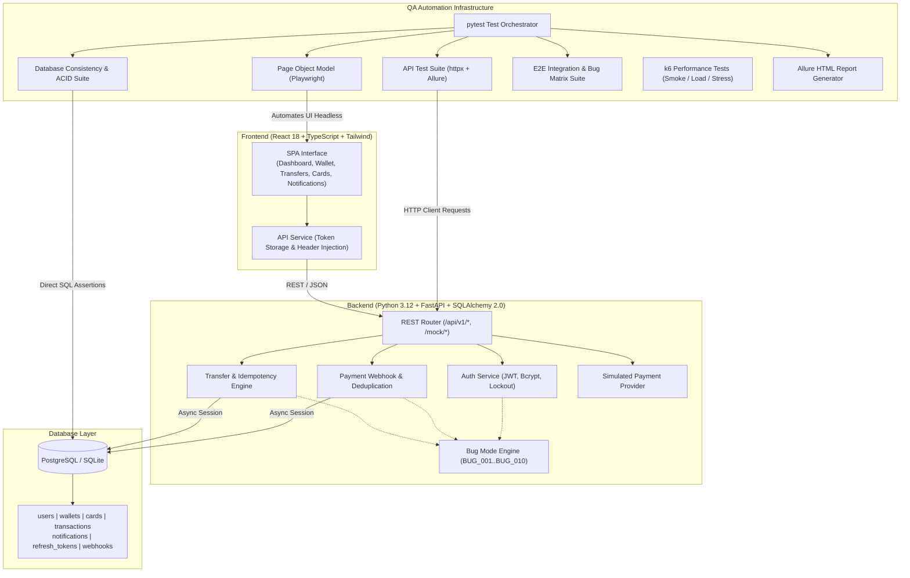

# FinPay QA Lab: Production-Grade Fintech & QA Automation Portfolio

[](.github/workflows/tests.yml)
[](https://fastapi.tiangolo.com)
[](https://python.org)
[](https://playwright.dev)
[](https://pytest.org)
[](https://www.postgresql.org)
[](https://www.docker.com)
[](https://qameta.io/allure-report/)

> **A comprehensive, real-world open-source QA engineering portfolio project.**  
> Featuring a modern fintech web application paired with an enterprise-grade multi-layer QA automation infrastructure (API, UI Playwright POM, Direct SQL & ACID validation, Security IDOR checks, k6 Performance testing, CI/CD pipeline, and an interactive 10-defect `BUG_MODE` engine).

---

## 🎯 Project Mission & QA-First Focus

In financial systems, software defects directly lead to capital loss, regulatory penalties, and reputational collapse. **FinPay QA Lab** was engineered from the ground up not merely as a web application, but as an **authoritative testing benchmark** that demonstrates how a Senior/Lead QA Automation Engineer designs, builds, and maintains a multi-layer quality engineering framework.

### Key Highlights
- **100% Automated Multi-Tier Pyramid:** Covers Unit/Schema validation, REST API endpoints, Direct Database ACID consistency, headless Playwright UI flows, and k6 performance tests.
- **Defect Injection Engine (`BUG_MODE`):** Toggle `BUG_MODE=true` to dynamically inject 10 realistic fintech defects (e.g. double-spend race conditions, negative amount exploits, webhook replay balance duplication, and authentication bypasses) documented in [docs/bug-reports.md](docs/bug-reports.md).
- **Formal Test Design Techniques:** Demonstrates Equivalence Partitioning, Boundary Value Analysis, Decision Tables, and State Transition testing.
- **Enterprise Reporting:** Rich Allure reporting with automated failure screenshots, Playwright video/traces, request/response logging, and GitHub Actions CI artifacts.

---

## System Architecture



---

## Tech Stack

| Layer | Technologies | Description |
|---|---|---|
| **Backend** | Python 3.12, FastAPI, SQLAlchemy 2.0, Pydantic v2, Alembic, Bcrypt, PyJWT | Asynchronous, type-safe REST API with automatic OpenAPI documentation. |
| **Frontend** | React 18, TypeScript, Vite, Tailwind CSS, Lucide Icons | Responsive, sleek fintech dashboard with data-testid attributes for stable UI automation. |
| **Databases** | PostgreSQL 16 (Docker/CI), SQLite / aiosqlite (Portable Local) | Full schema parity, foreign keys, unique constraints, and transaction isolation. |
| **QA Automation** | Pytest, Playwright, httpx, Faker, Allure-Pytest, Requests | Page Object Model, reusable clients, factories, fixtures, and auto-screenshot capture. |
| **Performance** | Grafana k6 | Smoke, Load (30 VUs), and Stress (100+ VUs) test scenarios with strict latency thresholds. |
| **DevOps & CI** | Docker, Docker Compose, GitHub Actions, Nginx | Multi-stage Docker builds, healthchecks, automated CI jobs with Allure artifact uploads. |

---

## Financial Core Architecture & Invariant Guarantees

To ensure complete engineering transparency and accurate terminology, the platform enforces the following design invariants:

- **Atomic Multi-Currency Balance Ledger:** Rather than a full double-entry chart of accounts (asset/liability/equity debits & credits), FinPay implements an atomic multi-currency balance adjustment ledger model with mathematical invariant conservation: `Δ Sender_balance == -Amount` and `Δ Receiver_balance == +Converted_amount`. All adjustments execute inside single atomic database transactions.
- **Configured Static Exchange Rates:** Currency conversions between `USD`, `EUR`, and `UAH` use deterministic configured rates (`USD: 1.0`, `EUR: 0.92`, `UAH: 39.5`) defined in system configuration. (External live market rate feeds are deliberately out of scope to preserve test reproducibility).
- **ISO/IEC 7812 Luhn Algorithm:** Virtual card issuance generates valid 16-digit PANs with ISO/IEC 7812 Mod 10 Luhn checksums and validates card numbers accordingly. In accordance with PCI-DSS guidelines, PANs are stored masked (`**** **** **** 1234`), and CVVs are simulated for test sandbox authorization without plain-text production persistence.
- **Concurrency & Idempotency Engine:** 
  - On PostgreSQL (CI & Docker), concurrent transfers employ pessimistic row-level locking (`SELECT ... FOR UPDATE`) to eliminate balance overdraft race conditions.
  - On SQLite (Local Dev), concurrent transactions utilize per-user asyncio lock serialization combined with database unique constraints on `idempotency_key`.
  - Concurrent replays with identical idempotency keys yield exactly 1 transaction, 1 balance deduction, and identical consistent responses (HTTP 200/201) to all callers without 500 errors.

---

## ⚡ Quickstart

### Option A: Running with Docker Compose (Recommended)
Launch the entire system (PostgreSQL 16, FastAPI backend, and Nginx frontend) with a single command:

```bash
# Clone the repository
git clone https://github.com/trydkg/finpay-qa-lab.git
cd finpay-qa-lab

# Build and start all services
docker compose up --build -d

# Check service health
docker compose ps
```
- **Web Dashboard:** [http://localhost:3000](http://localhost:3000)
- **Interactive Swagger API Docs:** [http://localhost:8000/docs](http://localhost:8000/docs)
- **Health Endpoint:** [http://localhost:8000/health](http://localhost:8000/health)

### Option B: Local Development Setup
```bash
# 1. Create Python virtual environment and install dependencies
uv venv --python 3.12
source .venv/bin/activate
uv pip install -r backend/requirements.txt -r tests/requirements.txt
playwright install chromium

# 2. Install frontend dependencies
cd frontend && npm install && cd ..

# 3. Seed database with deterministic test accounts
make seed

# 4. Start backend & frontend concurrently
make run
```

---

## 👥 Seeded Test Personas

The seed script initializes 5 realistic customer profiles with multi-currency balances:

| Email | Password | Role / Account State | Starting Balances |
|---|---|---|---|
| `john.doe@example.com` | `Password123!` | Active Customer | $5,000.00 USD, €2,500.00 EUR, ₴50,000.00 UAH |
| `jane.smith@example.com` | `Password123!` | Active Customer | $3,200.00 USD, €1,800.00 EUR, ₴20,000.00 UAH |
| `alex.wilson@example.com` | `Password123!` | Active Customer | $1,500.00 USD, €900.00 EUR, ₴10,000.00 UAH |
| `locked.user@example.com` | `Password123!` | **LOCKED** (Security Policy) | $500.00 USD, €300.00 EUR, ₴5,000.00 UAH |
| `qa.tester@example.com` | `Password123!` | QA Automation Persona | $10,000.00 USD, €8,000.00 EUR, ₴150,000.00 UAH |

---

## 🧪 Comprehensive QA Test Suite

The automated test framework is located under `tests/` and structured as follows:

```
tests/
├── api/             # 31 REST API Tests (Status codes, Schemas, Boundary Values)
├── ui/              # 12 Playwright UI E2E Test Methods (Page Object Model, 15 assertions)
├── database/        # 4 Direct SQL Balance Conservation & Constraint Tests
├── integration/     # 13 E2E Lifecycles, Concurrency, & Defect Reproduction Matrix Tests
├── security/        # 9 IDOR, Auth Bypass, SQLi & XSS Tests
├── performance/     # 3 k6 Performance Scenarios (Smoke, Load, Stress)
├── pages/           # Page Object Model locators & actions
├── api_client/      # Fluent HTTP client abstractions with Allure logging
├── factories/       # Faker-based user, card, and transfer test data generators
└── fixtures/        # Pytest fixtures and failure hooks
```

### Running Automated Tests

```bash
# Run ALL 69 automated tests
make test-all

# Run specific test layers
make test-api          # Run API test suite (31 tests)
make test-ui           # Run Playwright UI tests (12 tests)
make test-db           # Run Database ACID & SQL tests (4 tests)
make test-integration  # Run Concurrency, E2E & Bug Matrix tests (13 tests)
make test-security     # Run IDOR, SQLi & XSS tests (9 tests)

# Generate and view Allure Report
make allure-generate
make allure-serve
```

---

## 🪲 Defect Injection Engine (`BUG_MODE`)

A core innovation of **FinPay QA Lab** is its switchable defect engine. When `BUG_MODE=true` is set (via environment variable or the `/api/debug/bugs` test hook), the platform activates 10 realistic fintech defects:

| Bug ID | Title | Component | Description & Impact |
|---|---|---|---|
| **BUG-001** | Duplicate Transfer Execution | `TransferService` | Idempotency key lookup bypassed; replayed request debits sender twice. |
| **BUG-002** | Duplicate Webhook Double Credit | `WebhookService` | Event deduplication disabled; duplicate webhook credits receiver multiple times. |
| **BUG-003** | Expired JWT Allowed on Transactions | `API Security` | Expiration check skipped; stale tokens can read transaction history. |
| **BUG-004** | Negative Amount Transfer Allowed | `TransferService` | Negative amounts accepted, inflating the sender's balance. |
| **BUG-005** | Pagination Returns Duplicate Records | `TransactionService` | Off-by-one offset error repeats the last item of page 1 as the first item of page 2. |
| **BUG-006** | Self-Transfer Allowed | `TransferService` | Sender == Receiver check skipped, permitting redundant self-transfers. |
| **BUG-007** | Inverted Currency Conversion Rate | `WalletService` | Applies inverse multiplier during cross-currency transfers. |
| **BUG-008** | Transaction Stuck in PENDING State | `WebhookService` | Successful webhook commits without updating transaction status to SUCCESS. |
| **BUG-009** | Locked User Can Login | `AuthService` | Account lock check omitted during login credential validation. |
| **BUG-010** | UI Balance Stale After Transfer | `Frontend Modal` | Modal fails to trigger treasury query re-fetch after transfer completion. |

> Detailed steps to reproduce, preconditions, severities, and evidence for every defect are documented in [docs/bug-reports.md](docs/bug-reports.md).

---

## 📊 Performance Testing (k6)

Performance tests benchmark system behavior across authentication, wallet treasury queries, and transfer history endpoints:

```bash
# Run smoke test (3 VUs, 15s)
.venv/bin/k6 run tests/performance/k6-smoke.js

# Run load test (30 VUs, 40s)
.venv/bin/k6 run tests/performance/k6-load.js

# Run stress breakpoint test (100+ VUs)
.venv/bin/k6 run tests/performance/k6-stress.js
```

### Measured Smoke Test Baseline (Actual Execution)
- **Virtual Users (VUs):** 3 looping VUs for 15s
- **Completed Iterations:** 45 iterations
- **Total HTTP Requests:** 91 (5.89 req/sec)
- **Assertion Checks:** 136 checks (100.00% passed, 0 failures)
- **Error Rate (`http_req_failed`):** `0.00%` (0 out of 91)
- **Request Latency (`http_req_duration`):**
  - **Average:** `9.98ms`
  - **Median:** `9.86ms`
  - **P90:** `12.84ms`
  - **P95:** `14.14ms` (Threshold: `p(95) < 300ms` — **PASSED**)
  - **Max:** `212.09ms` (initial cryptographic Argon2/Bcrypt hash verification)

---

## 🔄 CI/CD Pipeline (GitHub Actions)

The repository includes a production-grade multi-job GitHub Actions workflow (`.github/workflows/tests.yml`):

1. **Lint Job:** Enforces strict PEP8 formatting and type checks with `ruff`, and TypeScript verification with `tsc`.
2. **API & Database Job:** Boots a real PostgreSQL 16 service container, executes Alembic migrations, seeds data, and runs 35 API & SQL tests.
3. **Integration & Security Job:** Validates end-to-end lifecycles, IDOR isolation, concurrent transfers, and the `BUG_MODE` defect matrix.
4. **UI Playwright Job:** Executes 12 headless browser test suites (15 assertions), capturing traces and full-page screenshots on failure.
5. **Allure Report Job:** Gathers test outputs from all matrix jobs, compiles a unified static Allure HTML report, and publishes downloadable artifacts.

---

## 📑 Test Documentation Links

- **[Final QA Audit Report](docs/final-qa-audit.md)** — Comprehensive production-style QA audit with real verified metrics, bug fixes, and architectural limitations.
- [Test Plan](docs/test-plan.md) — Comprehensive scope, test levels, and environment specification.
- [Test Strategy](docs/test-strategy.md) — Test pyramid, test design techniques (EP, BVA, Decision Tables), and flakiness mitigations.
- [Test Cases](docs/test-cases.md) — Exhaustive catalog of automated test cases with step-by-step verification.
- [Bug Reports](docs/bug-reports.md) — Industry-standard defect reports for all 10 `BUG_MODE` defects.
- [Risk Analysis Matrix](docs/risk-analysis.md) — Financial and security risk scoring matrix.
- [Requirements Traceability Matrix](docs/traceability-matrix.md) — Mapping from business rules to automated tests and bug IDs.

---

## ⚖️ License
This project is open-source under the [MIT License](LICENSE). Designed and built with pride for QA Engineer portfolio showcases.
